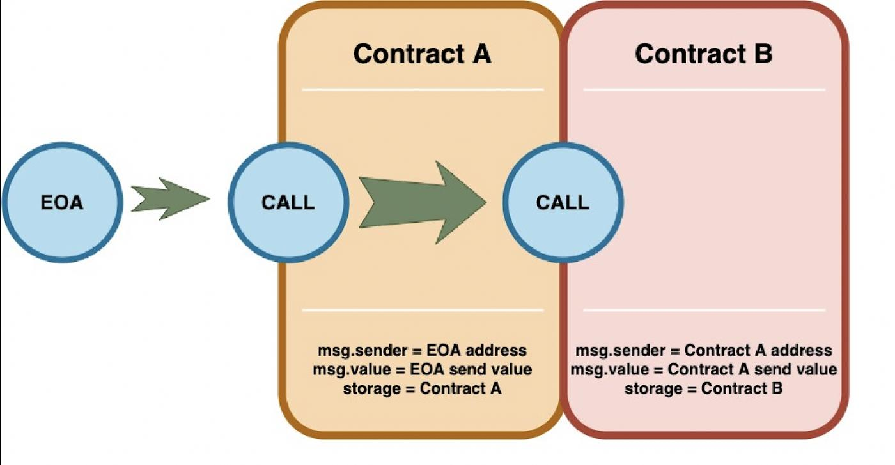

# Initializer functions for Proxies
In Solidity, code that is inside a constructor or part of a global variable declaration is not part of a deployed
contract’s runtime bytecode. This code is executed only once, when the contract instance is deployed. As a consequence
of this, the code within a logic contract’s constructor will never be executed in the context of the proxy’s state.
To rephrase, proxies are completely oblivious to the existence of constructors. It’s simply as if they weren’t there for the proxy.

The problem is easily solved though. Logic contracts should move the code within the constructor to a regular
'initializer' function, and have this function be called whenever the proxy links to this logic contract. Special care
needs to be taken with this initializer function so that it can only be called once, which is one of the properties
of constructors in general programming.

In proxy implementation, we want the proxy contract to store all the state because if in the future implementation
changes, we will still have access to all transactions or other state variables. But if your implementation has a
constructor, the state inside the implementation will be stored inside the implementation instead of proxy.

https://docs.openzeppelin.com/upgrades-plugins/1.x/proxies

### Explanation of state for proxy pattern

In Ethereum, there are three major types of contract calls: regular `CALL`, `STATICCALL`, and `DELEGATECALL`.

When contract A makes a CALL to contract B by calling `foo()`, the function execution relies on contract B’s storage,
and the msg.sender is set to contract A.

This is because contract A called the function foo(), so that the msg.sender would be contract A’s address and
`msg.value` would be the ETH sent along with that function call. Changes made to state during that function call can
only affect contract B.




However, when the same call is made using `DELEGATECALL`, the function foo() would be called on contract B but in the
context of contract A. This means that the logic of contract B would be used, but any state changes made by the
function foo() would affect the storage of contract A. And also, msg.sender would point to the EOA who made the call
in the first place.


how can we handle the constructor logic? The contract’s constructor is automatically called during contract deployment.

But this is no longer possible when proxies are in play, as the constructor would change only the implementation
contract’s storage (Contract B), not the storage of the proxy contract (Contract A), which is the one that matters.

Therefore, an additional step is required. We need to change the constructor in a regular function. This function is
conventionally called initialize or init, this function will be called on the proxy contract once both contracts have
been published, so as to save all changes of state on the proxy contract (contract A) and not on the
implementation (contract B )

### Solution
To ensure that the initialize function can only be called once, a simple modifier is used. OpenZeppelin Upgrades 
provides this functionality via a contract that can be extended:

```solidity
// contracts/MyContract.sol
// SPDX-License-Identifier: MIT
pragma solidity ^0.6.0;

import "@openzeppelin/contracts-upgradeable/proxy/utils/Initializable.sol";

contract MyContract is Initializable {
    function initialize(
        address arg1,
        uint256 arg2,
        bytes memory arg3
    ) public payable initializer {
        // "constructor" code...
    }
}
```

# Upgrades - Unstructured Storage Proxies

### Storage Collision between proxy and implementation
A problem that quickly comes up when using proxies has to do with the way in which variables are stored in the proxy 
contract. Suppose that the proxy stores the logic contract’s address in its only variable address public 
`_implementation`;. Now, suppose that the logic contract is a basic token whose first variable is address 
public `_owner`. Both variables are 32 byte in size, and as far as the EVM knows, occupy the first slot of the 
resulting execution flow of a proxied call. When the logic contract writes to _owner, it does so in the scope of the 
proxy’s state, and in reality writes to _implementation. This problem can be referred to as a "storage collision".

```
| Proxy                   | Implementation    |
|-------------------------|-------------------|
| address _implementation | address _owner    | <=== Storage collision!
| ...                     | mapping _balances |
|                         | uint256 _supply   |
|                         | ...               |
```
There are many ways to overcome this problem, and the "unstructured storage" approach which OpenZeppelin Upgrades 
implements works as follows. Instead of storing the _implementation address at the proxy’s first storage slot, it 
chooses a pseudo random slot instead. This slot is sufficiently random, that the probability of a logic contract 
declaring a variable at the same slot is negligible. The same principle of randomizing slot positions in the proxy’s 
storage is used in any other variables the proxy may have, such as an admin address (that is allowed to update the 
value of _implementation), etc.

```
| Proxy                   | Implementation    |
|-------------------------|-------------------|
| ...                     | address _owner    |
| ...                     | mapping _balances |
| ...                     | uint256 _supply   |
| ...                     | ...               |
| ...                     |                   |
| ...                     |                   |
| ...                     |                   |
| ...                     |                   |
| address _implementation |                   | <=== Randomized slot.
| ...                     |                   |
| ...                     |                   |
```
### Storage Collisions Between Implementation Versions
Storage collisions between different versions of the logic contract can occur. In this case, imagine that the first 
implementation of the logic contract stores address public _owner at the first storage slot and an upgraded logic 
contract stores address public _lastContributor at the same first slot. When the updated logic contract attempts to 
write to the _lastContributor variable, it will be using the same storage position where the previous value for _owner 
was being stored, and overwrite it!

Incorrect storage preservation:
```
| Implementation_v0 | Implementation_v1        |
|-------------------|--------------------------|
| address _owner    | address _lastContributor | <=== Storage collision!
| mapping _balances | address _owner           |
| uint256 _supply   | mapping _balances        |
| ...               | uint256 _supply          |
|                   | ...                      |
```

Correct storage preservation:
```
| Implementation_v0 | Implementation_v1        |
|-------------------|--------------------------|
| address _owner    | address _owner           |
| mapping _balances | mapping _balances        |
| uint256 _supply   | uint256 _supply          |
| ...               | address _lastContributor | <=== Storage extension.
|                   | ...                      |
```

The unstructured storage proxy mechanism doesn’t safeguard against this situation. It is up to the user to have new 
versions of a logic contract extend previous versions, or otherwise guarantee that the storage hierarchy is always 
appended to but not modified. However, OpenZeppelin Upgrades detects such collisions and warns the developer appropriately.


----
TIP: To avoid leaving the proxy in an uninitialized state, the initializer function should be called as early as
possible by providing the encoded function call as the `_data` argument to {ERC1967Proxy-constructor}.

